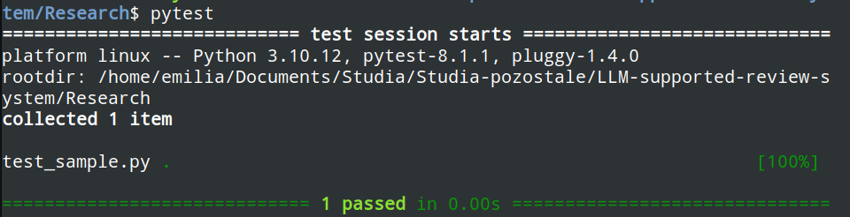
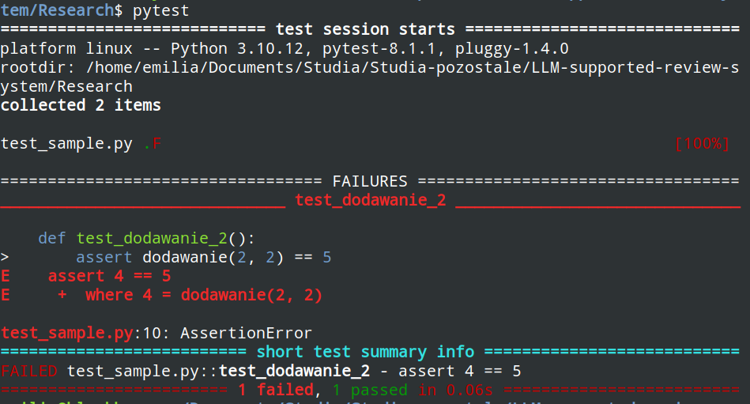

## Instalacja:

```bash
pip install -U pytest
```

## Dokumentacja:

https://docs.pytest.org/en/8.0.x/index.html

## Uruchamianie testu: 

```bash
pytest 
```

**ważne**: trzeba być w 'LLM-supported-review-system/Research$', inaczej na razie będzie wywalać, bo nie ma jeszcze testów w pozostałych plikach pythonowych

oczywiście ostateczie zostanie to naprawione, ale na razie jest jak jest

## Wynik:

jeśli przechodzi dostajemy:


a jeśli nie, to:


## Dodatkowe info:

1. pytest sprawdza wszystkie pliki test_*.py i *_test.py, dlatego jak uruchomimy w /LLM_... to będzie próbować uruchamiać test_llama.py, dlatego będzie trzeba zmienić pewnie później nazwę pliku
2. można jeszcze jakieś fajne rzeczy z przechwytywaniem errorów czy innych robić, potem dorzucę do kodu przykłady
3. dokumentacja jest fajna i czytelna, więc w razie pytań polecam

to be updated (prawdopodobnie)...
